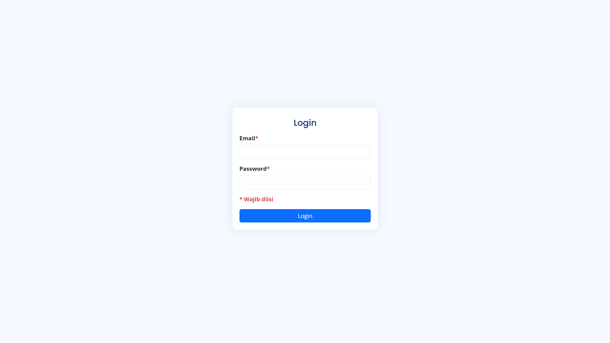
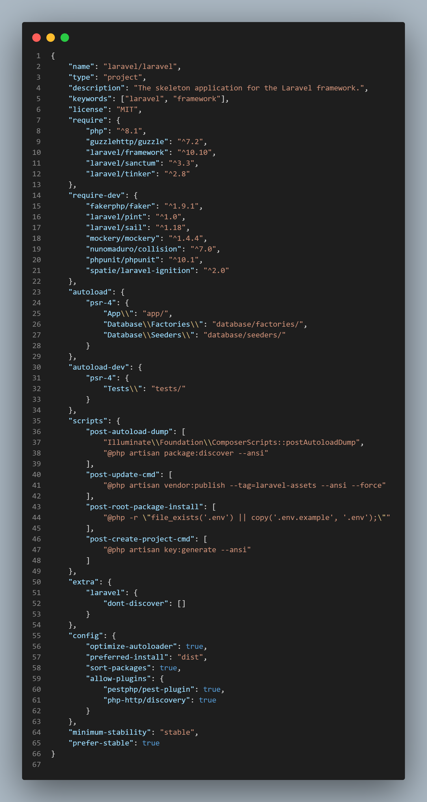

# Resource

GitHub: https://github.com/agiftsanyazhar/DOT-Indonesia-Batch-3.git

GDrive: https://drive.google.com/drive/folders/1Cage-kcOJ8Sd-7FAfYd-tuk0wkf1flJ8?usp=sharing

Demo: https://prototype-dot-indonesia-batch-3.agiftsany-azhar.web.id/

HackerRank: https://www.hackerrank.com/certificates/309bf95e5af6

Postman: https://www.postman.com/gold-eclipse-674635/workspace/dot-indonesia-batch-3

# Simple CMS Project

Project ini merupakan project Content Management System (CMS) sederhana/simple yang terinspirasi dari WordPress. Project ini berisi page Login dan Dashboard. Page Login merupakan page yang pertama kali diakses ketika mengakses project ini sedangkan page Dashboard akan ditampilkan apabila user menginputkan email dan password dengan benar. Saat memasuki Dashboard, user akan diarahkan ke menu Artikel yang berisi list artikel. List artikel ini mengandung informasi seperti featured image, judul artikel, deskripsi artikel, pembuat artikel, tanggal dibuat, serta tanggal diedit. User dapat melakukan Create, Update, Delete (CUD) pada artikel dengan cara menekan ikon plus untuk Create, menekan ikon pensil untuk Update, dan menekan ikon sampah untuk menghapus. Pada bagian form terdapat beberapa keterangan, salah satunya yaitu ikon bintang merah yang artinya bahwa field tersebut wajib diisi.

Setiap artikel juga dapat memiliki satu atau lebih gambar yang fungsinya adalah untuk slideshow gambar (jika diimplementasikan pada real project/case). Untuk mengakses fitur tersebut user dapat menekan ikon mata yang nantinya akan diarahkan ke halaman detail dari artikel tersebut. Halaman detail akan menampilkan detail dari artikel yang dipilih dan juga bisa dilakukan fitur CUD untuk menambahkan gambar saja.

## Desain Database

Desain databasenya sangat sederhana dengan penjelasan sebagai berikut:

1. users -> articles = one to many. Artinya, setiap user dapat membuat/memiliki satu atau lebih artikel. Sebaliknya, setiap artikel yang dibuat setidaknya dimiliki tepat oleh satu user.
2. articles -> article_images = one to many. Artinya, setiap artikel dapat mengandung satu atau lebih gambar untuk slideshow. Sebaliknya, satu slideshow harus memiliki (wajib) satu artikel karena sebagai FK.

## Screenshot Aplikasi

## Dependencies

* [SweetAlert2](https://sweetalert2.github.io/ "SweetAlert2")
* [Quill Text Editor](https://quilljs.com/ "Quill Text Editor")
* [Bootstrap](https://getbootstrap.com/ "Bootstrap")
* [Google Fonts](https://fonts.google.com/ "Google Fonts")
* Sisanya pakai dependency bawaan Laravel
  

## Informasi Lebih Lanjut

Untuk memudahkan developer selanjutnya meneruskan project ini, maka harus menyesuaikan versi minimal dengan beberapa hal berikut:

1. PHP 8.2.22
2. Apache 2.4.62
3. MySQL 8.0.32
4. Laravel 10.48.22
5. Composer 2.4.1

## About Laravel

Laravel is a web application framework with expressive, elegant syntax. We believe development must be an enjoyable and creative experience to be truly fulfilling. Laravel takes the pain out of development by easing common tasks used in many web projects, such as:

- [Simple, fast routing engine](https://laravel.com/docs/routing).
- [Powerful dependency injection container](https://laravel.com/docs/container).
- Multiple back-ends for [session](https://laravel.com/docs/session) and [cache](https://laravel.com/docs/cache) storage.
- Expressive, intuitive [database ORM](https://laravel.com/docs/eloquent).
- Database agnostic [schema migrations](https://laravel.com/docs/migrations).
- [Robust background job processing](https://laravel.com/docs/queues).
- [Real-time event broadcasting](https://laravel.com/docs/broadcasting).

Laravel is accessible, powerful, and provides tools required for large, robust applications.

## Learning Laravel

Laravel has the most extensive and thorough [documentation](https://laravel.com/docs) and video tutorial library of all modern web application frameworks, making it a breeze to get started with the framework.

You may also try the [Laravel Bootcamp](https://bootcamp.laravel.com), where you will be guided through building a modern Laravel application from scratch.

If you don't feel like reading, [Laracasts](https://laracasts.com) can help. Laracasts contains thousands of video tutorials on a range of topics including Laravel, modern PHP, unit testing, and JavaScript. Boost your skills by digging into our comprehensive video library.

## Laravel Sponsors

We would like to extend our thanks to the following sponsors for funding Laravel development. If you are interested in becoming a sponsor, please visit the [Laravel Partners program](https://partners.laravel.com).

### Premium Partners

- **[Vehikl](https://vehikl.com/)**
- **[Tighten Co.](https://tighten.co)**
- **[WebReinvent](https://webreinvent.com/)**
- **[Kirschbaum Development Group](https://kirschbaumdevelopment.com)**
- **[64 Robots](https://64robots.com)**
- **[Curotec](https://www.curotec.com/services/technologies/laravel/)**
- **[Cyber-Duck](https://cyber-duck.co.uk)**
- **[DevSquad](https://devsquad.com/hire-laravel-developers)**
- **[Jump24](https://jump24.co.uk)**
- **[Redberry](https://redberry.international/laravel/)**
- **[Active Logic](https://activelogic.com)**
- **[byte5](https://byte5.de)**
- **[OP.GG](https://op.gg)**

## Contributing

Thank you for considering contributing to the Laravel framework! The contribution guide can be found in the [Laravel documentation](https://laravel.com/docs/contributions).

## Code of Conduct

In order to ensure that the Laravel community is welcoming to all, please review and abide by the [Code of Conduct](https://laravel.com/docs/contributions#code-of-conduct).

## Security Vulnerabilities

If you discover a security vulnerability within Laravel, please send an e-mail to Taylor Otwell via [taylor@laravel.com](mailto:taylor@laravel.com). All security vulnerabilities will be promptly addressed.

## License

The Laravel framework is open-sourced software licensed under the [MIT license](https://opensource.org/licenses/MIT).
